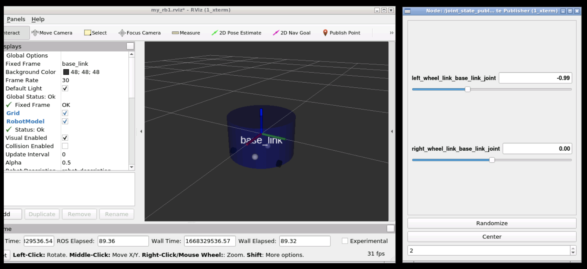

# my_rb1_description



Clone this project to your `catkin_ws/src`.

Open 3 shells

1. roscore

```
source ~/catkin_ws/devel/setup.bash
roscore
```

2. gazebo

```
source ~/simulation_ws/devel/setup.bash
source ~/catkin_ws/devel/setup.bash
roslaunch my_rb1_description my_rb1_model.launch
```

3. rviz
```
source ~/simulation_ws/devel/setup.bash
source ~/catkin_ws/devel/setup.bash
roslaunch my_rb1_description rviz.launch
```
